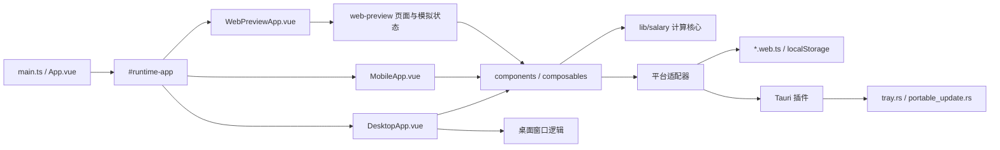

# PayDance 架构与修改导航

> [English version →](ARCHITECTURE_EN.md)

## 运行边界

- `src/App.vue` 通过 Vite 别名 `#runtime-app` 选择桌面端、移动端或 Web Preview 入口。
- `src/MobileApp.vue` 复用工资看板、设置和 Tauri Store，不导入窗口、托盘、进程或更新 API。
- `src/lib/salary/` 是纯工资计算核心；`src/lib/salary.ts` 只负责导出公共接口。
- `src/composables/` 负责设置、计时、主题和窗口等应用行为，其中桌面窗口 composable 可依赖 Tauri。
- `src/components/` 包含主看板、设置、首次向导、迷你窗口等界面组件。
- `src/web-preview/` 包含官网页面、浏览器内交互模拟和分区样式。
- `src/platform/` 提供设置存储、链接打开和更新检查的目标适配器；Web 构建选用 `*.web.ts`。
- `src-tauri/src/tray.rs` 负责托盘、单实例唤起和主窗口销毁处理。
- `src-tauri/src/portable_update.rs` 负责 Windows 便携版更新；`src-tauri/src/lib.rs` 只装配插件、命令和启动模块。

## 主要数据流

1. Vite 根据构建模式选择运行入口和平台适配器。
2. `useSalarySettings.ts` 从 Tauri Store 或 `localStorage` 读取设置。
3. `settings-migration.ts` 修复薪资配置，`window-mode.ts` 归一化窗口偏好。
4. `useSalaryTicker.ts` 使用混合单调时钟生成当前时间，并调用 `src/lib/salary/` 计算收入、进度和下一次状态变化。
5. `useDashboardModel.ts` 将计算结果转换为界面状态和文案。
6. 桌面端的窗口、托盘、自启动和更新由 composable、平台适配器与 Rust 分层处理，不进入工资计算核心。

## 修改导航

| 修改内容 | 主要位置 | 最低验证 |
|---|---|---|
| 工资规则、午休、夜班 | `src/lib/salary/` | `npm test -- src/lib/salary` |
| 薪资设置或迁移 | `src/lib/settings-migration.ts`、`src/lib/settings-store.ts`、`src/composables/useSalarySettings.ts` | `npm test -- src/lib/settings-migration.test.ts src/composables/useSalarySettings.test.ts` |
| 窗口尺寸、位置或迷你模式 | `src/lib/window-mode.ts`、`src/composables/useWindow*.ts` | `npm test -- src/lib/window-mode.test.ts src/composables/useWindowMode.test.ts src/composables/useWindowPositionRecovery.test.ts` |
| 主窗口、设置或首次向导 | `src/components/`、`src/styles/`、`src/DesktopApp.vue` | `npm test`、`npm run build:desktop` |
| 界面文案与翻译 | `src/i18n/types.ts`、`src/i18n/locales/zh-CN.ts`、`src/i18n/locales/en.ts` | `npm run build:desktop`（缺键由 `vue-tsc` 报出） |
| Web Preview 页面、路由或样式 | `src/web-preview/`、`src/WebPreviewApp.vue`、`index.html`、`en/index.html` | `npm run build:web`、`npm run qa:web-preview` |
| Android / iOS 移动端 | `src/MobileApp.vue`、`src-tauri/capabilities/mobile.json`、`vite.config.ts` | `npm run build:mobile`，再在对应平台执行 `npm run android:dev` 或 `npm run ios:dev` |
| 托盘、单实例或 Rust 窗口事件 | `src-tauri/src/tray.rs`、`src-tauri/src/lib.rs` | `cargo test --manifest-path src-tauri/Cargo.toml`、相关 Vitest |
| 自启动 | `src/lib/autostart.ts`、`src/composables/useAutostart.ts` | `npm test -- autostart` |
| 便携版更新与发布 | `src/platform/updater.ts`、`src-tauri/src/portable_update.rs`、`.github/workflows/release.yml` | `npm run verify:release` |
| 依赖或工作流元数据 | `package.json`、`src-tauri/Cargo.toml`、`.github/` | `npm run verify:metadata` |

## 必须保持的边界

- 工资计算不得读取存储、窗口或 Tauri API。
- 目标差异通过 Vite 别名和平台适配器隔离；Web 与移动构建不得包含桌面入口或 Tauri 运行代码。
- `src/web-preview/web-preview.css` 的分区导入顺序影响层叠结果；调整后必须运行 Web Preview QA。
- 托盘和便携版更新的实现留在独立 Rust 模块，不回填到 `src-tauri/src/lib.rs`。
- `src/architecture-size.test.ts` 锁定 `OnboardingPanel.vue`、`SettingsPanel.vue`、`src/lib/salary.ts`、`web-preview.css` 和 `lib.rs` 的行数上限；新增逻辑拆到子模块，不要撑大这几个文件。

界面改动遵循[设计规范](DESIGN.md)；持久化、推送和发布规则见[维护约定](MAINTENANCE.md)；验证流程见 [Web Preview QA](web-preview-qa.md) 与[桌面端冒烟清单](desktop-smoke-checklist.md)。
