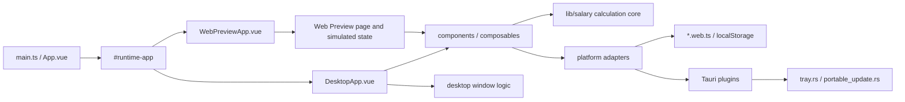

# PayDance Architecture and Change Map

> [中文版 →](ARCHITECTURE.md)

## Runtime Boundaries

- `src/App.vue` uses the Vite `#runtime-app` alias to select the desktop or Web Preview entry point.
- `src/lib/salary/` is the pure salary-calculation core; `src/lib/salary.ts` only exports its public API.
- `src/composables/` owns application behavior for settings, time, themes, and windows. Desktop window composables may depend on Tauri.
- `src/components/` contains the dashboard, settings, onboarding, mini window, and related UI.
- `src/web-preview/` contains the website, browser-side interaction simulation, and section styles.
- `src/platform/` provides target adapters for settings storage, external links, and updates. Web builds select the `*.web.ts` variants.
- `src-tauri/src/tray.rs` handles the tray, single-instance wake-up, and main-window destruction.
- `src-tauri/src/portable_update.rs` handles Windows portable updates. `src-tauri/src/lib.rs` only wires plugins, commands, and startup modules.

## Main Data Flow

1. Vite selects the runtime entry point and platform adapters from the build mode.
2. `useSalarySettings.ts` loads settings from Tauri Store or `localStorage`.
3. `settings-migration.ts` repairs salary settings, while `window-mode.ts` normalizes window preferences.
4. `useSalaryTicker.ts` obtains time from the hybrid monotonic clock and calls `src/lib/salary/` to calculate earnings, progress, and the next state transition.
5. `useDashboardModel.ts` converts calculation results into UI state and copy.
6. Desktop windows, tray behavior, autostart, and updates remain in composables, platform adapters, and Rust; they do not enter the salary core.

## Change Map

| Change | Primary location | Minimum validation |
|---|---|---|
| Salary rules, lunch, or overnight shifts | `src/lib/salary/` | `npm test -- src/lib/salary` |
| Salary settings or migration | `src/lib/settings-migration.ts`, `src/lib/settings-store.ts`, `src/composables/useSalarySettings.ts` | `npm test -- src/lib/settings-migration.test.ts src/composables/useSalarySettings.test.ts` |
| Window size, position, or mini mode | `src/lib/window-mode.ts`, `src/composables/useWindow*.ts` | `npm test -- src/lib/window-mode.test.ts src/composables/useWindowMode.test.ts src/composables/useWindowPositionRecovery.test.ts` |
| Main window, settings, or onboarding | `src/components/`, `src/styles/`, `src/DesktopApp.vue` | `npm test`, `npm run build:desktop` |
| UI copy and translations | `src/i18n/types.ts`, `src/i18n/locales/zh-CN.ts`, `src/i18n/locales/en.ts` | `npm run build:desktop` (`vue-tsc` reports missing keys) |
| Web Preview page, routing, or styles | `src/web-preview/`, `src/WebPreviewApp.vue`, `index.html`, `en/index.html` | `npm run build:web`, `npm run qa:web-preview` |
| Tray, single instance, or Rust window events | `src-tauri/src/tray.rs`, `src-tauri/src/lib.rs` | `cargo test --manifest-path src-tauri/Cargo.toml`, focused Vitest |
| Autostart | `src/lib/autostart.ts`, `src/composables/useAutostart.ts` | `npm test -- autostart` |
| Portable updates and releases | `src/platform/updater.ts`, `src-tauri/src/portable_update.rs`, `.github/workflows/release.yml` | `npm run verify:release` |
| Dependencies or workflow metadata | `package.json`, `src-tauri/Cargo.toml`, `.github/` | `npm run verify:metadata` |

## Required Boundaries

- Salary calculations must not read storage, window, or Tauri APIs.
- Vite aliases and platform adapters isolate target differences. Web builds must not contain the desktop entry point or Tauri runtime code.
- Import order in `src/web-preview/web-preview.css` affects the cascade; run Web Preview QA after changing it.
- Tray and portable-updater implementation stays in dedicated Rust modules, not `src-tauri/src/lib.rs`.
- `src/architecture-size.test.ts` caps the line count of `OnboardingPanel.vue`, `SettingsPanel.vue`, `src/lib/salary.ts`, `web-preview.css`, and `lib.rs`. Split new logic into submodules instead of growing those files.

UI changes follow the [design guide](DESIGN.md), which is Chinese-only. Persistence, push, and release rules live in [Maintenance](MAINTENANCE_EN.md); validation runs through [Web Preview QA](web-preview-qa_EN.md) and the [desktop smoke checklist](desktop-smoke-checklist_EN.md).
