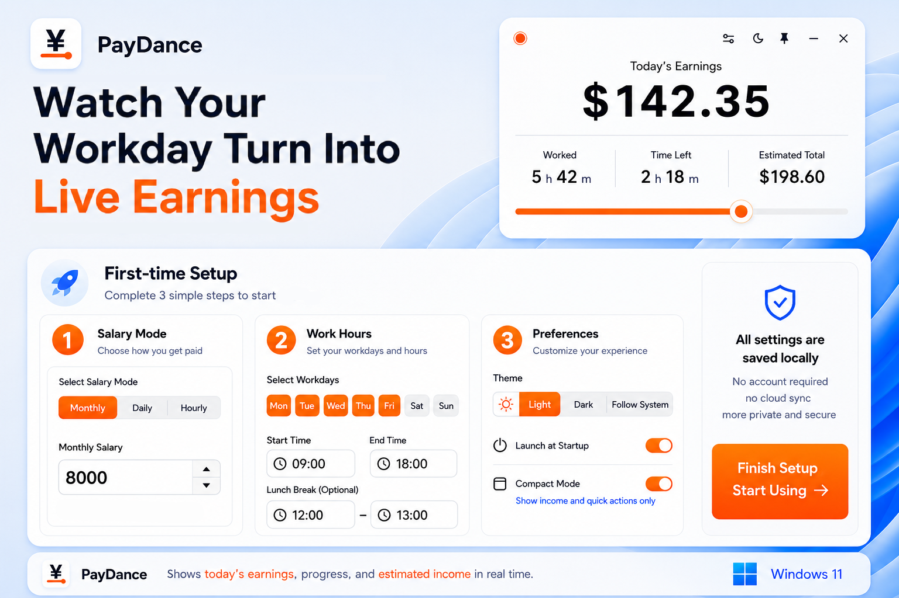

<p align="center">
  
</p>

<h1 align="center">PayDance 薪跳</h1>

<p align="center">
  Put "the money you are earning today" on your desktop, and watch it grow, second by second
</p>

<p align="center">
  <a href="https://paydance.vercel.app/en/"><strong>Live Preview</strong></a>
  &nbsp;&nbsp;·&nbsp;&nbsp;
  <a href="https://github.com/MrBaoboer/PayDance/releases/latest"><strong>Download</strong></a>
  &nbsp;&nbsp;·&nbsp;&nbsp;
  <a href="../README.md">中文</a>
</p>

<p align="center">
  <a href="https://github.com/MrBaoboer/PayDance/releases/latest"></a>
  <a href="https://github.com/MrBaoboer/PayDance/releases"></a>
  <a href="../LICENSE"></a>
</p>

---

## What It Is

PayDance (薪跳) is a desktop real-time salary dashboard. Set your salary and working hours, and it shows your income growing second by second on your desktop, making the value of your working time visible.

The main window shows today's earnings, work progress, time remaining, and daily estimate. The mini floating window keeps only the amount, ready for a quick glance from the corner of your screen.

<p align="center">
  
</p>

## Features

- **Live earnings**: Today's amount updates continuously and is shown to two decimal places.
- **Common pay schedules**: Supports monthly, daily, and hourly pay, configurable workdays, lunch-break exclusion, and overnight shifts.
- **Mini window**: Shows only the amount, stays draggable and always on top, and supports 10%–100% opacity. Double-click it to restore the main window.
- **Local-first**: No account required; your salary settings stay on your own machine.
- **Bilingual UI**: The interface, tray menu, and validation messages support Simplified Chinese and English.
- **Windows integration**: Includes light and dark themes, a system tray, auto-start, and background updates.

## Get It

<div align="center">

| &nbsp; | Link | Notes |
|:---:|:---:|:---:|
| 🌐 | **[Live Preview](https://paydance.vercel.app/en/)** | Browser-based, all core features available, nothing to install |
| ⬇️ | **[Windows Desktop](https://github.com/MrBaoboer/PayDance/releases/latest/download/pay-dance-v0.9.9-windows-x64.exe)** | Portable EXE with tray, always-on-top, mini float, and auto-start |

</div>

Each release includes a SHA256 checksum file so you can verify the download.

## Tech Stack

<div align="center">

| Layer | Technologies |
|:---:|:---:|
| Desktop shell | Tauri 2 + Rust |
| Frontend | Vue 3 + TypeScript + Vite |
| UI | Windows 11 styling, CSS Container Queries, Lucide Icons |
| Storage | Local app data directory (Tauri Store) / browser localStorage |
| Testing | Vitest + Rust unit tests + vue-tsc + cargo clippy |

</div>

The Web Preview and desktop app share the same core salary logic and frontend UI.

## Development

**Install dependencies**

```powershell
npm install
```

**Desktop app**

```powershell
npm run tauri dev
```

**Web Preview**

```powershell
npm run dev:web
```

**Build Windows portable EXE**

```powershell
npm run build:exe
```

**Build web preview**

```powershell
npm run build:web
```

**Android app**

After installing the Android SDK, JDK 17, and NDK, initialize the native project and connect a device or emulator:

```powershell
npm run android:init
npm run android:dev
```

Build an installable Android package:

```powershell
npm run android:build
```

**iPhone/iPad app**

The iOS project must be initialized, signed, and built on macOS with Xcode installed:

```bash
npm run ios:init
npm run ios:dev
npm run ios:build
```

Mobile builds retain salary calculations, local settings, theme selection, and the live dashboard. The tray, mini floating window, autostart, and Windows portable updater remain desktop-only.

**Reset local config to open the first-run wizard again**

```powershell
Remove-Item "$env:APPDATA\com.masterbao.paydance\salary-settings.json"
```

For commit conventions, verification commands, and contribution workflow, see the [Contributing Guide](CONTRIBUTING_EN.md).

## Privacy

PayDance requires no login, uploads no data, and includes no telemetry. All configuration is saved locally via Tauri Store in `salary-settings.json`, containing only salary parameters, work hours, and UI preferences.

## Documentation

- [FAQ](FAQ_EN.md)
- [Architecture and Change Map](ARCHITECTURE_EN.md)
- [Product Positioning & Boundaries](PRODUCT_EN.md)
- [Roadmap](ROADMAP_EN.md)
- [Changelog](../CHANGELOG_EN.md)

## License

Designed and developed by Mr.Baoboer. Code licensed under [AGPL-3.0-only](../LICENSE).

For full license information and trademark policy, see the [Legal Guide](../legal/LEGAL_EN.md).

---

> [中文版 README →](../README.md)
