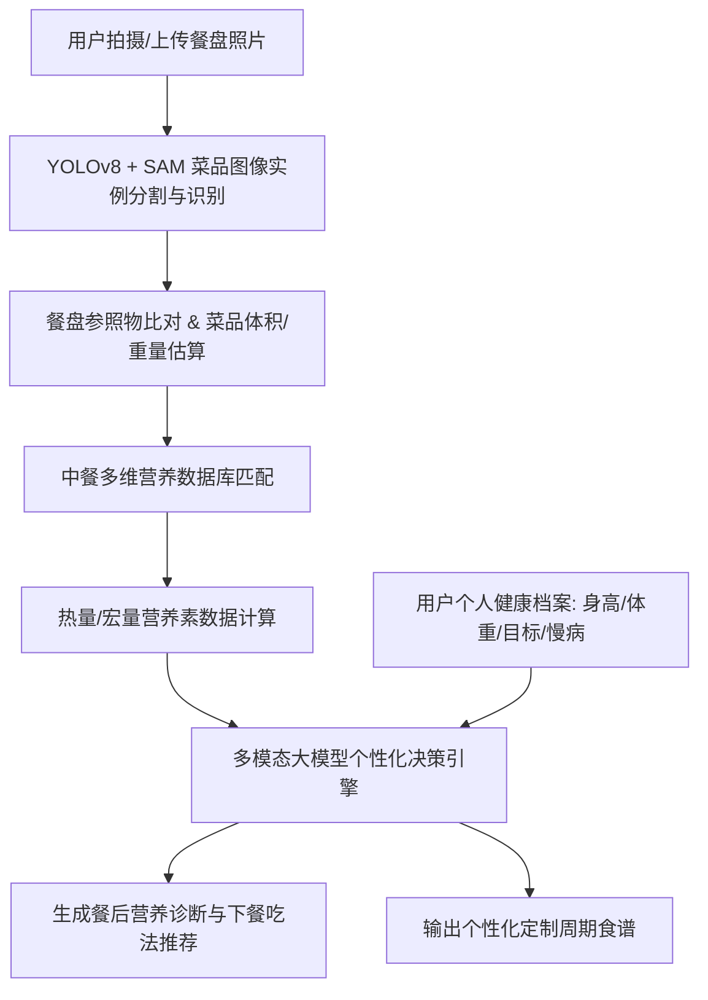

# “膳眸智识”——基于多模态大模型的AI智能膳食分析与个性化控卡推荐平台
## 大学生创新创业训练计划 / 互联网+ 参赛项目计划书

---

### 一、 执行总结（Executive Summary）
在“健康中国2030”战略推进及全民体重管理意识爆发的背景下，超重与慢病年轻化成为普遍痛点。然而，传统膳食记录工具依赖繁琐的人工手动搜索输入，中餐菜式复杂导致热量估算偏差大、用户流失率高。
本项目推出**“膳眸智识”**轻量化微信小程序，核心结合**计算机视觉（CV）目标检测与实例分割**技术与**多模态大语言模型（LLM）**，实现：
1. **拍照1秒知热量**：自研中餐菜品分割网络与体积/热量估算模型，单张照片精准识别多道菜品。
2. **多维健康画像诊断**：基于用户体质（BMI、基础代谢率BMR、过敏源、血糖血压指标及减脂/增肌诉求）建立数字健康档案。
3. **AI动态闭环推荐**：大模型根据当餐摄入与每日总配额，动态智能指导“下一餐多吃什么、少吃什么”，生成千人千面的营养膳食建议。

---

### 二、 行业背景与市场痛点（Market Pain Points）
1. **庞大的健康管理需求**：我国成年人超重及肥胖率超50%，糖尿病前期人群庞大。大学生及年轻白领面临外卖重油重盐、体态焦虑等健康挑战。
2. **传统工具门槛极高**：现有主流软件（薄荷健康、MyFitnessPal等）要求用户逐项搜索食材并输入克重，记账极其繁琐，超70%用户在7天内放弃。
3. **中餐菜品非标化难点**：西餐食材单一易计算，而中餐烹饪方式多（煎炒烹炸）、混合配菜多，通用AI模型直接估算误差常超过40%，缺乏针对中餐的专属知识图谱。

---

### 三、 产品功能与核心技术架构

#### 1. 核心功能模块
- **AI智能抓拍辨热量**：对准餐盘拍照，自动框选多道菜品，秒级输出各菜品名称、预估重量、卡路里、蛋白质、碳水化合物及脂肪。
- **健康数字人档案**：动态追踪身高体重变化趋势、体脂率、运动代谢，智能计算每日能量缺口。
- **AI膳食智能调优决策**：大模型根据历史记录与当餐情况进行深度诊断（如“午餐碳水超额30%，晚餐建议摄入优质蛋白如清蒸鸡胸肉+高纤维西兰花”）。
- **个性化周期食谱定制**：一键生成按周排布的营养餐单及食材采购清单（支持外卖点餐指导）。

#### 2. 技术创新亮点
- **中餐细粒度视觉识别算法**：采用轻量级目标检测模型结合中餐数据集微调，中餐经典菜品识别率达92%以上。
- **结合提示词工程与RAG（检索增强生成）**：搭载中国居民膳食指南知识库，杜绝大模型胡说，确保营养建议严谨权威。
- **轻量化端云协同架构**：微信小程序即开即用，云端异步批处理优化算力成本，单次推理响应控制在1.2秒内。

---

### 四、 商业模式与盈利路径
1. **C端 Freemium（免费+增值）订阅模式**：
   - 基础版：每日拍照识别3次、基础热量统计免费。
   - Pro高级会员（12-18元/月）：无限次AI图像识别、大模型定制专属周期食谱、AI营养师7×24小时深度问诊对话。
2. **健康生态供应链带货与分成**：
   - 针对食谱推荐与电商/外卖平台对接（低卡零食、代餐、健康调味汁、轻食外卖等），获取CPS推广分成。
3. **B端企业与健身机构合作（SaaS拓展）**：
   - 为高校食堂、轻食连锁餐厅提供“菜品热量标签数字化”方案；为健身房私教提供学员饮食打卡管理后台。

---

### 五、 推广策略与运营规划
1. **第一阶段：高校校园冷启动（0 - 6个月）**
   - 联合校内健身社团、减脂打卡营，发起“21天AI减脂营”打卡挑战，裂变获取种子用户5万人。
2. **第二阶段：社交矩阵破圈（6 - 18个月）**
   - 在小红书、抖音、B站打造“外卖怎么吃不胖”、“大学生食堂热量测评”等爆款视觉内容引流。
3. **第三阶段：生态联动与品牌升级（18 - 36个月）**
   - 联动慢病管理机构及健康食品品牌，拓展软硬件结合（智能食物秤等）。

---

### 六、 团队成员与分工构想
- **项目负责人/产品经理**：统筹项目进度、产品原型设计、申报及商业策划。
- **AI算法工程师**：负责目标检测模型训练、图像分割微调、大模型提示词与知识库RAG搭建。
- **前端与小程序工程师**：负责微信小程序UI交互开发、数据可视化及用户体验优化。
- **后端与云原生工程师**：负责高并发API架构、用户数据库、微服务部署与缓存优化。
- **医学/营养学顾问**：负责中餐营养数据库核验、中国膳食营养指南规则校验。

---

### 七、 财务预测与预期收益
- **初创期投入**：服务器与GPU算力租赁（约30%）、模型标注与数据采集（约25%）、市场推广与活动（约35%）、运营杂费（约10%）。
- **收支平衡点**：预计在上线第10个月、付费会员渗透率达3.5%（活跃用户超15万）时实现单月收支平衡。
